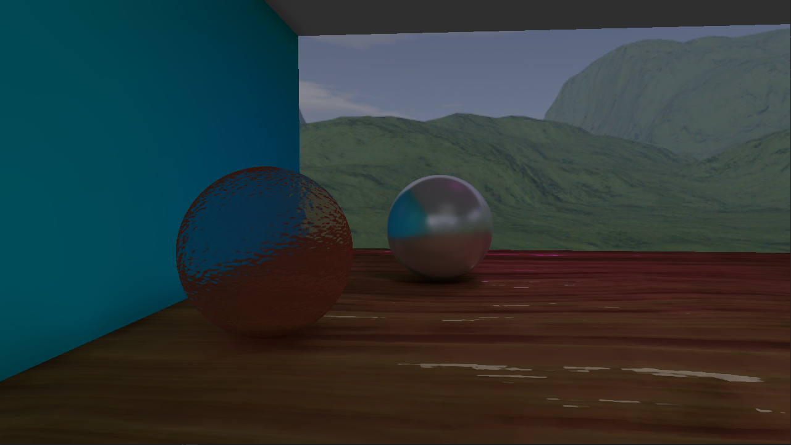
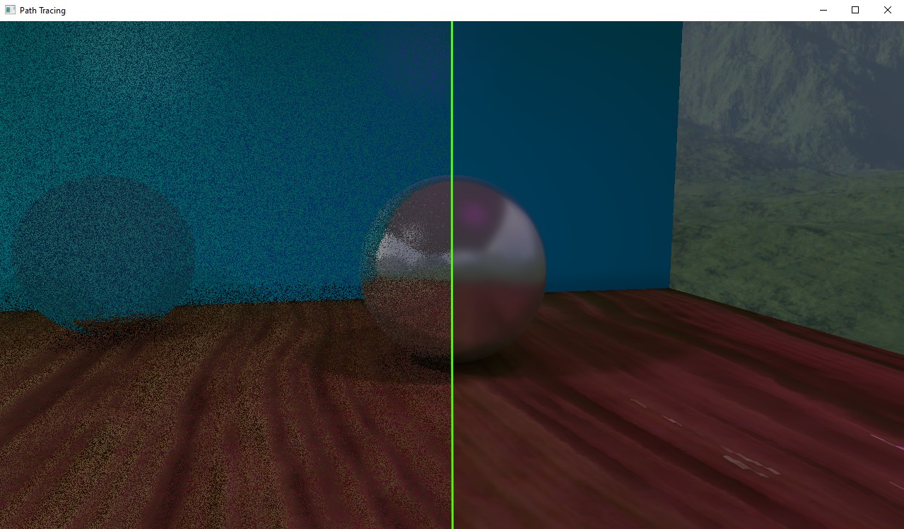

# DXR-Path-Tracer
The application is built using the source code from "Uno Game Engine", which follows the same engine structure as defined in the book "3D Game Programming with DirectX 12" by Frank D. Luna.
Ray tracing has been implemented following NVIDIA's tutorials and uses a version of their libraries modified by me.
https://developer.nvidia.com/rtx/raytracing/dxr/DX12-Raytracing-tutorial-Part-1
https://developer.nvidia.com/rtx/raytracing/dxr/dx12-raytracing-tutorial-part-2

# Implementation Notes
The file `src/utils/keys.h` contains all private keys used by the engine and therefore it's not included among the project files.
It defines an `inline const char projectKey[38]` inside engine namespace initialized following the NVIDIA DLSS' guidelines: 
> Project ID is assumed to be GUID-like, for instance: "a0f57b54-1daf-4934-90ae-c4035c19df04"

It is also important to mention that in order to run the project you need the libraries `NRD.dll`, `dxcompiler.dll`, `dxil.dll`, `nvngx_dlss.dll` inside the folder where the executable is located.
You can download them from the respective repositories (note that the NRD dll will be available after compiling the NRD project).
Alternatively you can run it in release mode and use the DLLs that you find in the latest release.

# DLSS
**DLSS** has been implemented following NVIDIA's guidelines
https://github.com/NVIDIA/DLSS/blob/main/doc/DLSS_Programming_Guide_Release.pdf

# Denoising
The application uses **NRD** to denoise diffuse, specular and shadow signals.
https://github.com/NVIDIAGameWorks/RayTracingDenoiser

