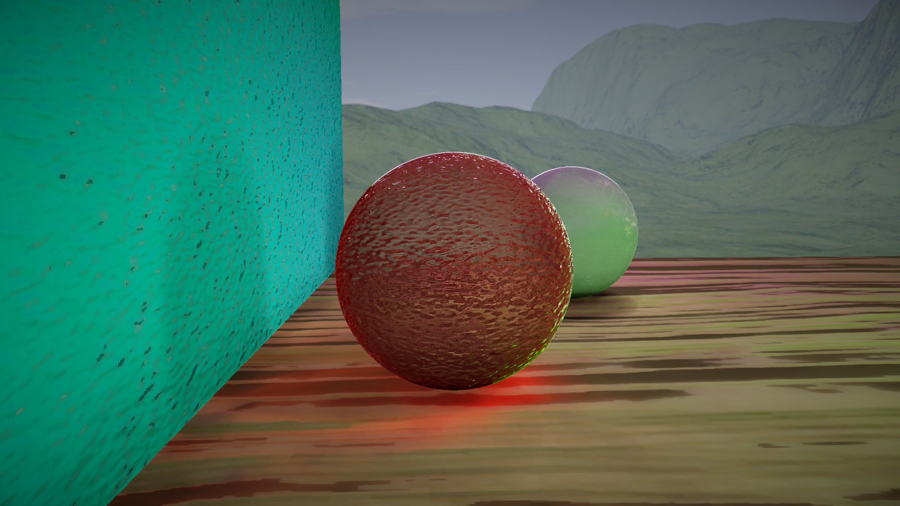

# DXR-Path-Tracer
The application a fork of UnoGameEngine, my own game engine that started from an implementation of the code from the book "3D Game Programming with DirectX 12" by Frank D. Luna.
Ray tracing has been implemented following NVIDIA's tutorials and uses a version of their libraries modified by me.
https://developer.nvidia.com/rtx/raytracing/dxr/DX12-Raytracing-tutorial-Part-1
https://developer.nvidia.com/rtx/raytracing/dxr/dx12-raytracing-tutorial-part-2

This path tracer includes:
- DirectX Raytracing (DXR)
- Monte carlo path tracing
- NVIDIA DLSS
- NVIDIA NRD denoiser (Spherical Harmonics Mode)
- PBR materials
- PBR rendering
- Ray reconstruction (blurry)

# DLSS
**DLSS** has been implemented following NVIDIA's guidelines
https://github.com/NVIDIA/DLSS/blob/main/doc/DLSS_Programming_Guide_Release.pdf

# Denoising
The application uses **NRD** to denoise diffuse, specular and shadow signals.
https://github.com/NVIDIAGameWorks/RayTracingDenoiser

# Implementation Notes
The file `src/utils/keys.h` contains all private keys used by the engine and therefore it's not included among the project files.
It defines an `inline const char projectKey[38]` inside engine namespace initialized following the NVIDIA DLSS' guidelines: 
> Project ID is assumed to be GUID-like, for instance: "a0f57b54-1daf-4934-90ae-c4035c19df04"

It is also important to mention that in order to run the project you need the libraries `NRD.dll`, `dxcompiler.dll`, `dxil.dll`, `nvngx_dlss.dll` and `nvngx_dlssd.dll` inside the folder where the executable is located.
You can download them from the respective repositories (note that the NRD dll will be available after compiling the NRD project).
Alternatively you can run it in release mode and use the DLLs that you find in the latest release.

# Performance
On my machine (AMD Ryzen 7 1700, NVIDIA RTX 3060, 32GB RAM), 1080p all settings to max and DLSS off, I get the following performance:
- Box scene: ~40/50 FPS
- Flashlight scene: ~40/50 FPS
- Indirect scene: ~43/51 FPS

# Screenshots
Result:

Box scene:

Flashlight scene:

Indirect scene:

